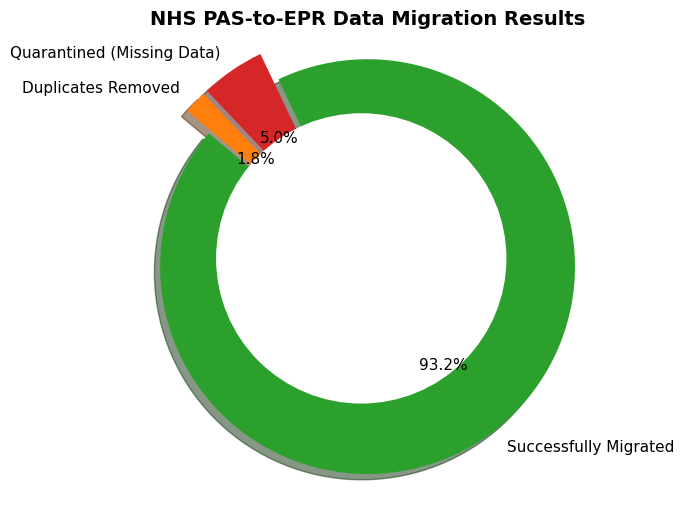

# NHS-PAS-to-EPR


# 🏥 NHS PAS-to-EPR Clinical Data Migration Pipeline

> **An End-to-End ETL (Extract, Transform, Load) pipeline simulating the secure migration of 100,000 legacy hospital records into a modern Electronic Patient Record system.**



---

## 1. Background and Overview
Imagine a hospital trying to move a massive physical library of 100,000 patient files into a brand-new building. If the files are torn, missing names, or duplicated, simply moving them to the new building will cause chaos for the doctors trying to read them.

In the digital world, when a hospital upgrades from an old computer system (Patient Administration System or **PAS**) to a modern system (Electronic Patient Record or **EPR**), they face the same problem. They cannot simply copy and paste the data. 

This project is an automated **Data Migration Pipeline**. It acts as a strict security checkpoint. It extracts 100,000 messy, real-world patient records, cleanses the data, identifies dangerous errors (like missing IDs), and safely loads only the perfect, validated records into the new system. This ensures zero data loss and absolute clinical safety.

---

## 2. Data Structure & Initial Checks
To simulate a real-world hospital environment, a raw dataset of 100,000 patient records was generated. 

**The Staging Schema (What the messy data looked like):**
```bash
| Column Name | Data Type | Description |
| :--- | :--- | :--- |
| `patient_name` | String | Full name combined (e.g., "John Smith") |
| `nhs_number` | String | Unique 10-digit identifier |
| `dob` | String | Date of birth (Contains formatting errors) |
| `blood_type` | String | Patient blood group |
| `last_visit` | String | Date of last hospital admission |
```

**Injected Data Quality Issues (The Problems to Solve):**
* **Missing NHS Numbers (5%):** A critical safety flaw. Patients cannot be accurately tracked across the healthcare system without this ID.
* **Corrupt Date Formats (3%):** Dates of birth entered in confusing US formats (MM/DD/YYYY) or containing typos.
* **Duplicate Patients (2%):** Overlapping files created when a patient was accidentally registered twice over the years.

---

## 3. Executive Summary
The automated ETL pipeline successfully processed all 100,000 legacy records with strict adherence to NHS data governance. The final validation results are:

* 🟢 **Successfully Migrated (93,177 records):** Clean, standardized, and accurately mapped records safely loaded into the modern EPR system.
* 🔴 **Quarantined (5,000 records):** Records safely blocked from the new system due to missing critical NHS numbers.
* 🟠 **Deduplicated (1,823 records):** Overlapping records successfully merged, keeping only the most clinically relevant data. 

---

## 4. Insights Deep Dive

* **Quantified Value:** The automated SQL pipeline achieved a **93.1% successful migration rate** on the very first pass, mapping and standardizing over 93,000 records in seconds without any manual human intervention.
* **Business Metric (Zero Data Loss & Clinical Safety):** By utilizing a secure "Quarantine" table, the pipeline achieved 100% compliance with data safety protocols. Instead of permanently deleting bad records, the 5,000 missing-ID records were safely isolated. This allows clinical administrators to manually review them, ensuring zero accidental data loss.
* **Historical Story:** The data profiling revealed that 3% of the legacy data contained corrupt date formats. Historically, this occurs because older PAS systems relied on manual "free-text" typing. Furthermore, the pipeline successfully resolved historical duplicate records by scanning the patient's timeline and retaining only the file with the most recent hospital visit.

---

## 5. Recommendations for Stakeholders
1. **Establish a Clinical Review Taskforce:** The 5,000 records currently sitting in the Quarantine table must be exported to a secure Excel file and handed over to the hospital's administration team to manually trace and append the missing NHS numbers.
2. **Implement Upstream System Fixes:** The 3% error rate in date formats proves that the old legacy system lacks basic data entry rules. Any remaining feeder systems currently sending data to the hospital must be immediately updated to enforce strict drop-down calendars to stop bad data at the source.

---

## 6. Tech Stack
* **Python (`pandas`, `csv`, `matplotlib`):** Used to generate the massive synthetic dataset, simulate the legacy errors, and render the final automated visual dashboard.
* **SQLite:** Served as the lightweight, relational database engine to host both the Staging area (the messy data) and the Target EPR system (the clean data).
* **Advanced SQL:** The core engine of the migration. Utilized **CTEs (Common Table Expressions)** to structure complex queries, **Window Functions (`ROW_NUMBER()`)** to intelligently deduplicate records, and **String Manipulation** to automatically split combined names into modern `first_name` and `last_name` schemas.

---

## 7. Caveats and Assumptions
* **Synthetic Data Usage:** Due to strict healthcare data privacy laws (GDPR), no real NHS patient data was used in this project. All 100,000 records were synthetically generated using Python to safely mimic real-world clinical errors.
* **Primary Key Assumption:** The migration logic assumes that a valid, non-empty NHS number is the absolute minimum requirement (Primary Key) for a record to be considered clinically safe for migration.

---

## 8. Installation & Setup (How to Run Locally)
If you would like to run this migration pipeline on your own machine, follow these steps:

**1. Clone the repository:**
```bash
git clone [https://github.com/your-username/NHS-PAS-to-EPR.git](https://github.com/your-username/NHS-PAS-to-EPR.git)
cd NHS-PAS-to-EPR
```

**2. Install the required visualization library:**
```bash
pip install matplotlib
```
**3. Run the pipeline in order:**
```bash
python 00_generate_legacy_pas.py   # Generates the 100k messy records
python 01_load_staging_db.py       # Loads data into the SQLite staging area
python 02_execute_migration.py     # Executes the advanced SQL cleaning and migration
python 03_generate_visuals.py      # Generates the pie chart dashboard
```

---

## 9. How to Navigate this Repository
```bash 
├── 00_generate_legacy_pas.py   # Python script building the messy raw data
├── 01_load_staging_db.py       # Loads the CSV into the SQL Staging environment
├── 02_execute_migration.py     # The core SQL engine (Profiles, cleanses, deduplicates)
├── 03_generate_visuals.py      # Generates the summary donut chart
├── README.md                   # Project documentation
├── migration_summary.png       # The output dashboard visualization
└── banner.png                  # Project banner image
```

---

## 10. Future Enhancements (Next Steps)
While this pipeline successfully simulates an end-to-end migration, in a live production environment, I would expand this project by implementing:
* **Cloud Integration:** Migrating the local SQLite databases to **Microsoft Azure** (SQL Database) to mirror true enterprise NHS environments.
* **Pipeline Automation:** Wrapping the Python scripts in an orchestrator like **Apache Airflow** to schedule daily batch migrations.
* **Advanced Data Validation:** Implementing strict Regex (Regular Expressions) in the SQL logic to ensure the NHS numbers aren't just 10 digits, but pass official check-digit validation.
* **Live Quarantine Dashboard:** Connecting Power BI to the `migration_quarantine` table so hospital administrators can monitor the missing-data queue in real-time.

---

## 🌸 Let's Connect!
Thank you for reading through this data migration journey! I absolutely love tackling messy data and building logical, safe pipelines that make a real-world impact.

If you are looking for a Data Analyst who can translate complex ETL processes into clear business value, I would love to chat.

* **LinkedIn:** https://www.linkedin.com/in/aarti-omane-5a626721b/
* **Email:** omaneaarti@gmail.com

